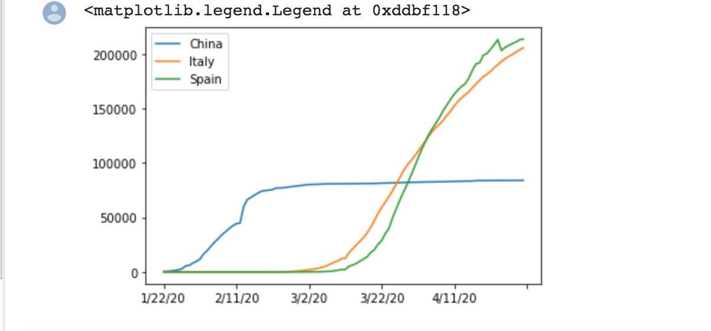
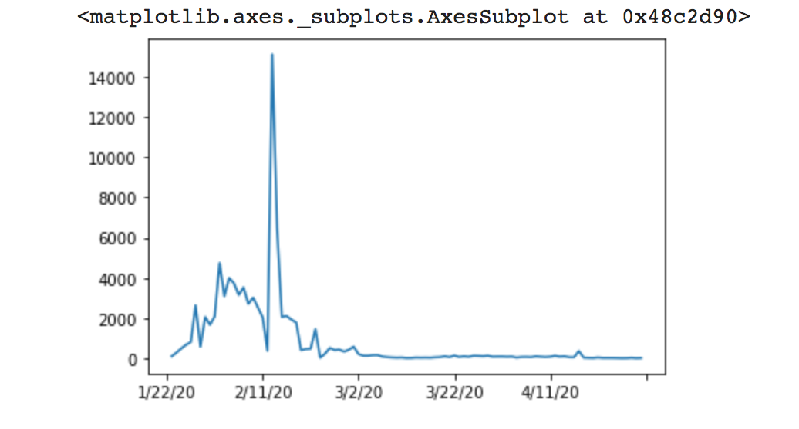
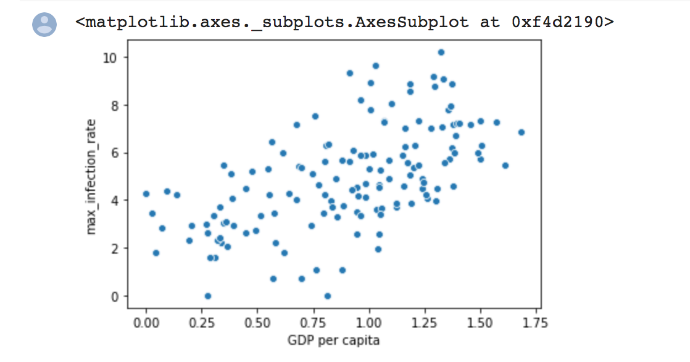

# COVID19 Analysis version-1

Data Analysis of Covid19

The scripts folder contains two files: 
1. python notebook file which can be run in colaboratory or jupyter notebook. 
2. a python file which can be run stand alone. (the notebook version is recommended for ease of execution of different cells of the code)

Example outputs : 

After calculating a good measure:

comparison between GDP and maximum infection rate:

